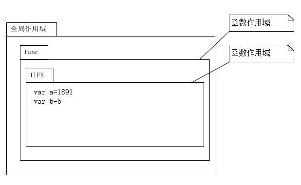
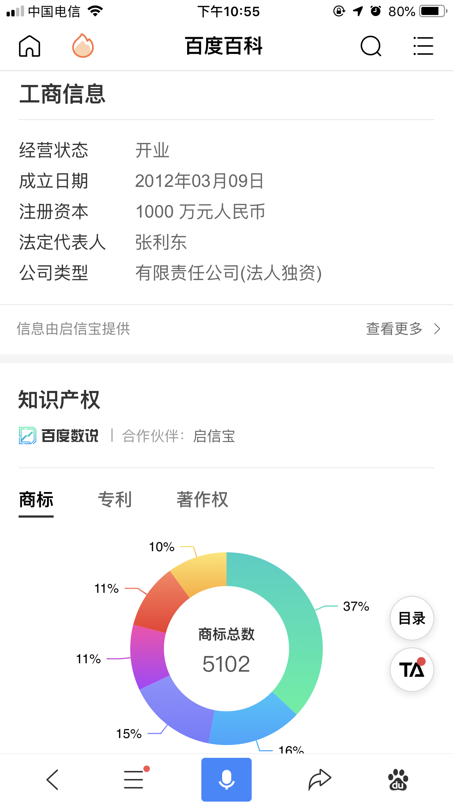

# 零.1.2 该公司是做什么的，实力怎么样，前景如何，口碑怎样？

知己知彼，百战不殆。在打算寻求入职某家一线互联网公司之前，多打听一下该公司背景情况，充分做好准备，以便面试时不慌。

## 零.1.2.1 用词条筛选一遍

比如我想要面试“字节跳动\(bytedance\)”，就会可以进百度APP搜索“字节跳动”，一般一线互联网企业都有专人维护自己的百度百科词条，而该词条内容是否丰富，体现这个企业是否有足够的人力去维护企业形象。词条内容越丰富月具体，说明该公司很重视企业形象，属于实力强大的特征之一。

<table>
  <thead>
    <tr>
      <th style="text-align:center">
        

        

          
        

      </th>
      <th style="text-align:center">
        

        

          
        

      </th>
    </tr>
  </thead>
  <tbody>
    <tr>
      <td style="text-align:center">&#x5B57;&#x8282;&#x8DF3;&#x52A8;-&#x767E;&#x5EA6;&#x767E;&#x79D1;</td>
      <td
      style="text-align:center">&#x8BCD;&#x6761;&#x4FE1;&#x606F;&#x6709;&#x4E13;&#x4EBA;&#x7EF4;&#x62A4;</td>
    </tr>
  </tbody>
</table>百度搜索一遍之后，大概就知道这家公司是做什么业务的，以及对公司实力有了一个初步印象了。

## 零.1.2.2 做好前景调查

然后进入知乎（[www.zhihu.com](https://www.zhihu.com/)）搜索该公司的业务关键字，看看高赞的话题评论。比如字节跳动主要产品《今日头条》和《抖音》，一个是做个性化信息流、一个是做小视频。那你就可以搜这些关键词，看看网上其他大牛在知乎上的评价。

## 零.1.2.3 打听口碑

口碑可以去“职声”这个APP查，也可以去“百度”、“知乎”搜索“xxx公司怎么样”以获得答案。如果平时人脉不错，可以去“微信前端群”、“QQ前端群”之类的前端专业群里询问群友，或者私下问问同行的朋友……总之多角度的打听清楚，从而对该公司口碑有一个立体清晰的认知。

## 零.1.2.4 调研该公司创始人

然后要提醒一下，一个公司的文化特征和这个公司最大的boss息息相关，所以也要记得调研一下这个公司的创始人，要认真思考看看是否是你欣赏和喜欢的，否则的话可能入职了一段时间会觉得不适应。

## 零.1.2.5 用好求职APP

如果对该公司的业务方向、产品形态、实力、前景都看好，而且口碑也不错的话，就可以针对这个公司搜索工作机会了。

搜索工作机会，推荐“Boss直聘”和“拉勾”。就前端而言，求职效果最好的就是这两个APP，Boss直聘的活跃程度要比拉勾高一些，Boss直聘是聊天勾搭且必须等对方回复了之后才能投简历，而拉勾是不用聊天就能直接投简历，各有优缺点，都可以试试，提高约面率。

## 零.1.2.**6** 用好猎头，事半功倍

**Boss直聘上有猎头，拉勾上也有。**

猎头是做什么的呢？通俗点说就是工作机会信息中介。如何识别猎头呢？可以在APP里点开招聘方人员的头像，再点“查看ta的更多内容”，看看他发布了多少个职位。如果发布的职位包含很多个公司，同时面试地点遍布中国各地，那很大几率该“HR”实际上是搜集简历的猎头。

中介服务良莠不齐，猎头也一样。猎头里面也有少数认真负责的，提供的是**顾问式**服务。如果碰到这样的猎头，值得职业生涯里携手共度。

而目前很多猎头为了业绩而力求多推荐，并没有用心帮求职者做沟通和面试建议，以及很少做跟踪服务，企业的反馈结果也没有及时传递回来……这样的猎头就是在浪费求职者的时间。所以从概率上来说，碰到一个认真负责的好猎头概率真的很低，建议不要把简历递给猎头，而应该**努力地递给真正的企业HR**，他们才会更多认真的去推荐给相关部门，并且一般都有跟踪服务和及时的反馈。

