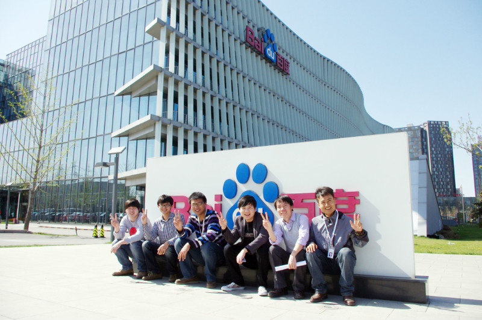

# 零.1.1 一线互联网公司有什么不同？

## 零.1.1.1 **首先，是“规模大，设施全，极具包容性”**

一线互联网公司的规模少则数千人，多则几万十来万人。办公室场地也超级大，成片的工位一望无际，办公场所内部设施齐全。以百度大厦为例，办公、吃饭、洗澡、睡眠、洗衣、健身、购物、娱乐……一应俱全，我在百度工作的时候，就曾经一个月在百度大厦里开心工作生活，不需要回家。

包容性在自己身上就得到了体现。我听力不好，加入360和百度这2个大集体后，丝毫不影响日常工作的合作和沟通。大家协作性、包容性意识都很强的，会尽全力互相配合，也比较有爱。这些大集体内还有很多奇奇怪怪的人，绝大多数都能自由地发挥出自己的特长，就像夜空中的点点繁星，各自自在地闪耀着光芒。

## 零.1.1.2 **其次，是“分工细，技术要求广度，但更重要的是深度”**

这里的工种划分十分细致。从产品的创意讨论、原型设计，到交互设计，然后到Photoshop图片、fireworks切图制作html/css静态页面，然后到写javascript前端业务逻辑，再到配置Linux服务器，安装数据库，建库，写后端API，web服务器架设，安全防卫，日常业务测试，打包上线……都有专业的人员把手。在这里，你可以很快地成长为某个领域的专家，而且随着时间增长，随着参与项目数量增加、规模增大，你会不断得到锻炼，逐渐成为专家中的专家。

而我在创业的时候，就没有太明确的分工概念。因为初创公司钱不多，所以能招到的人少，事情多的时候，恨不得一个人搞定所有，遂被成功锤（zhe）炼（ mo）成多面手，美其名曰“全栈工程师”😭。  

## 零.1.1.3 **有鲜明的文化特征**

比如百度的同学文化，字节跳动的极客文化，阿里巴巴的侠客文化，都是很有意思的文化。因此，衡量一家互联网公司是否是一线公司的标准之一，就是看它有没有鲜明的文化特征。  

## 零.1.1.4 **钟爱名校和高学历人才**

985和211毕业生是很受一线互联网公司欢迎的。虽然为了政治正确，这些公司口头上也说“是学历不限的，能力第一”，但是如果你是985或者211毕业的，会加分的。 当然，即使你不是985、211毕业生，也不是硕士博士，也没关系的，仍有非常非常多的不知名大学毕业、甚至辍学的朋友们在这些一线互联网企业做出了卓越的成绩。我在百度期间，就曾经为自己的团队不限学历地招聘了一个尚未毕业的专科生加入，而且他的表现确实惊艳。 由此可见，能力才是第一位的。  

## 零.1.1.5 **嗯嗯，开的薪资待遇高出一大截**

为了争夺人才实现公司正向循环发展，在薪酬竞赛中长期由这些一线互联网公司领跑，中小型互联网公司长期被压制，只能望其项背。目前同样的职业技能水平要求，字节跳动、快手、腾讯、饿了么、阿里巴巴等一线互联网大公司所开的年薪，几乎是其他中小型互联网公司的2倍甚至更高。

## 零.1.1.6 本篇结语

综上，在非一线互联网公司苦练3~5年之后，进入一线公司深造，把技术深度锤炼出来，是每一个有理想、有追求的前端工程师的必由之路。强烈推荐每个前端工程师，如果有条件、有机会的话，一定要入职一线互联网公司工作，体验那种多人大规模协作打造惊世产品的乐趣。这样的职业生涯，才是基本美满的。

