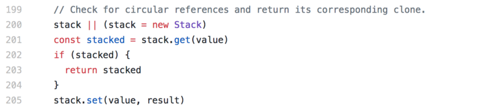

# 壹.3.1 深拷贝与浅拷贝

深/浅拷贝是容易被问到的一个知识点，考察的是对基础理论的掌握是否扎实。

## 壹.3.1.1 什么是深拷贝？什么是浅拷贝？

**深拷贝是指源对象与拷贝对象互相独立，其中任何一个对象的改动都不会对另外一个对象造成影响**。举个例子，一个人名叫张三，后来用他拷贝出（假设法律允许）另外一个人叫李四，不管是张三缺胳膊少腿还是李四缺胳膊少腿都不会影响另外一个人，这就是深拷贝了。比较典型的深拷贝就是JavaScript的"值类型"（7种数据类型），如 [string](https://developer.mozilla.org/en-US/docs/Glossary/string)，[number](https://developer.mozilla.org/en-US/docs/Glossary/number)，[bigint](https://developer.mozilla.org/en-US/docs/Glossary/bigint)，[boolean](https://developer.mozilla.org/en-US/docs/Glossary/boolean)，[null](https://developer.mozilla.org/en-US/docs/Glossary/null)，[undefined](https://developer.mozilla.org/en-US/docs/Glossary/undefined)，[symbol](https://developer.mozilla.org/en-US/docs/Glossary/symbol) 。

深拷贝之外的拷贝叫浅拷贝。

出于节省内存的考虑，JavaScript对"引用类型"（也即第8种数据类型）[Object](https://developer.mozilla.org/zh-CN/docs/Glossary/Object)的拷贝默认是浅拷贝。

## 壹.3.1.2 几种简单的深拷贝

### 1.JSON内置的方法

```javascript
(() => {
    let a = { x: 1 }
    let b = JSON.parse(JSON.stringify(a))
    console.log(b)//>> {x:1}
    b.x = 2
    console.log(b)//>> {x:2}
    console.log(a)//>> {x:1}
})();
```

该方法是用`JSON.stringify`将对象序列化为字符串，然后再用`JSON.parse`将JSON字符串解析为对象，解析的时候会自己去构建新的内存地址存放新对象。

**缺点：**

* 会忽略 `undefined`；
* 会忽略`symbol`；
* 如果对象的属性为Function，因为JSON格式字符串不支持Function，在序列化的时候会自动删除；
* 诸如 Map, Set, RegExp, Date, ArrayBuffer 和其他内置类型在进行序列化时会丢失；
* 不支持循环引用对象的拷贝。

### 2.Object的内置方法assign

```javascript
(() => {
    let a = { x: 1 }
    let b = Object.assign({},a);
    console.log(b)//>> {x:1}
    b.x = 2
    console.log(b)//>> {x:2}
    console.log(a)//>> {x:1}
})();
```

该方法是用Object.assign对对象进行拼接， 将后续对象的内容插入到第一个参数指定的对象，不会修改第一个参数之后的对象，而我们将第一个对象指定为一个匿名空对象，实现深拷贝。

> `Object.assign` 方法只会拷贝源对象自身的并且可枚举的属性到目标对象。

引自[MDN](https://developer.mozilla.org/zh-CN/docs/Web/JavaScript/Reference/Global_Objects/Object/assign)。所以这种方法拷贝会有缺陷。

**缺点：**

* 对象嵌套层次超过2层，就会出现浅拷贝的状况；
* 非可枚举的属性无法被拷贝。

### 3.使用MessageChannel

```javascript
// 有undefined + 循环引用
let obj = {
  a: 1,
  b: {
    c: 2,
    d: 3,
  },
  f: undefined
}

obj.c = obj.b;
obj.e = obj.a;
obj.b.c = obj.c;
obj.b.d = obj.b;
obj.b.e = obj.b.c;

function deepCopy(obj) {
  return new Promise((resolve) => {
    const {port1, port2} = new MessageChannel();
    port2.onmessage = ev => resolve(ev.data);
    port1.postMessage(obj);
  });
}

deepCopy(obj).then((copy) => {// 异步的
    let copyObj = copy;
    console.log(copyObj, obj)
    console.log(copyObj == obj)
});
```

**缺点：**

* 这个方法是异步的；
* 拷贝有函数的对象时，还是会报错。

## 壹.3.1.3 递归版深拷贝

前面的深拷贝都有缺点，有没有一种比较理想的办法？有的！

示例代码如下：

```javascript
function deepCopy(obj) {
    // 创建一个新对象
    let result = {}
    let keys = Object.keys(obj),
        key = null,
        temp = null;

    for (let i = 0; i < keys.length; i++) {
        key = keys[i];    
        temp = obj[key];
        // 如果字段的值也是一个对象则递归操作
        if (temp && typeof temp === 'object') {
            result[key] = deepCopy(temp);
        } else {
        // 否则直接赋值给新对象
            result[key] = temp;
        }
    }
    return result;
}
```

## 壹.3.1.4 循环引用之深拷贝

例如这种情况，obj引用自身：

```javascript
var obj = {
    name: 'coffe1891',
    sex: 'male'
};
obj['deefRef'] = obj;
```

此时如果调用上面的deepCopy函数的话，会陷入一个死循环，从而导致堆栈溢出。解决这个问题也非常简单，只需要判断一个对象的字段是否引用了这个对象或这个对象的任意父级即可，修改一下代码：

```javascript
function deepCopy(obj, parent = null) {
    // 创建一个新对象
    let result = {};
    let keys = Object.keys(obj),
        key = null,
        temp = null,
        _parent = parent;
    // 该字段有父级则需要追溯该字段的父级
    while (_parent) {
        // 如果该字段引用了它的父级则为循环引用
        if (_parent.originalParent === obj) {
            // 循环引用直接返回同级的新对象
            return _parent.currentParent;
        }
        _parent = _parent.parent;
    }
    for (let i = 0; i < keys.length; i++) {
        key = keys[i];
        temp = obj[key];
        // 如果字段的值也是一个对象
        if (temp && typeof temp === 'object') {
            // 递归执行深拷贝 将同级的待拷贝对象与新对象传递给 parent 方便追溯循环引用
            result[key] = DeepCopy(temp, {
                originalParent: obj,
                currentParent: result,
                parent: parent
            });

        } else {
            result[key] = temp;
        }
    }
    return result;
}
```

## 壹.3.1.5 非循环引用的子对象之拷贝

上面已经解决了深拷贝循环引用的问题，但是还不是特别的完善。

现在我们把一个对象想像成一棵树：  
对象A有B,C,D三个子对象，其中子对象D中有个属性E引用了对象A下面的子对象B。


用代码来表示就是这样：

```javascript
var A = {
    B: {
        name: 'b'
    },
    C: {
        name: 'c'
    },
    D: {

    }
};
A.D.E = A.B;
```

此时 A.D.E 与 A.B 是相等的，因为他们引用了同一个对象：

```javascript
console.log(A.B === A.D.E) //>> true
```

如果再调用刚才的DeepCopy函数深拷贝一份对象A的副本X：

```javascript
var X = DeepCopy(A);
console.log(X.B); //>> {name: "b"}
console.log(X.D.E);//>> {name: "b"}
console.log(X.B === X.D.E); //>> false
```

虽然 X.B 和 X.D.E在字面意义上是相等的，但二者并不是引用的同一个对象，这点上来看对象 X和对象A还是有差异的。

这种情况是因为 A.B 并不在 A.D.E 的父级对象链上，所以deepCopy函数就无法检测到A.D.E对A.B也是一种引用关系，所以deepCopy函数就将A.B深拷贝的结果赋值给了 X.D.E。

知道原因那么解决方案就呼之欲出了：父级的引用是一种引用，非父级的引用也是一种引用，那么只要记录下对象A中的所有对象，并与新创建的对象一一对应即可。

```javascript
function deepCopy(obj) {
    // Hash表 记录所有的对象引用关系
    let map = new WeakMap();
    function dp(obj) {
        let result = null;
        let keys = null,
            key = null,
            temp = null,
            existObj = null;
        
        existObj = map.get(obj);
        // 如果这个对象已被记录则直接返回
        if (existObj) {
            return existObj;
        }
        keys = Object.keys(obj);
        result = {};
        // 记录当前对象
        map.set(obj,result);
        for (let i = 0; i < keys.length; i++) {
            key = keys[i];
            temp = obj[key];
            // 如果字段的值也是一个对象则递归复制
            if (temp && typeof temp === 'object') {
                result[key] = dp(temp);
            } else {
                // 否则直接赋值给新对象
                result[key] = temp;
            }
        }
        return result;
    }
    return dp(obj);
}
```

测试一下看看：

```javascript
var X = deepCopy(A);
console.log(X.B); // >> {name: "b"}
console.log(X.D.E);// >> {name: "b"}
console.log(X.B === X.D.E); //>> true
```

## 壹.3.1.6 终极完美方案：lodash

[lodash](https://lodash.com/)的`_.cloneDeep()`支持循环对象、大量的内置类型，对很多细节都处理的比较不错，推荐使用。 

那么，lodash是如何解决循环引用这个问题的？查阅源码：



会发现lodash是用一个栈记录了所有被拷贝的引用值，如果再次碰到同样的引用值的时候，不会再去拷贝一遍，而是利用之前已经拷贝好的。

综上，在生产环境，我们推荐使用lodash的`cloneDeep()`。

