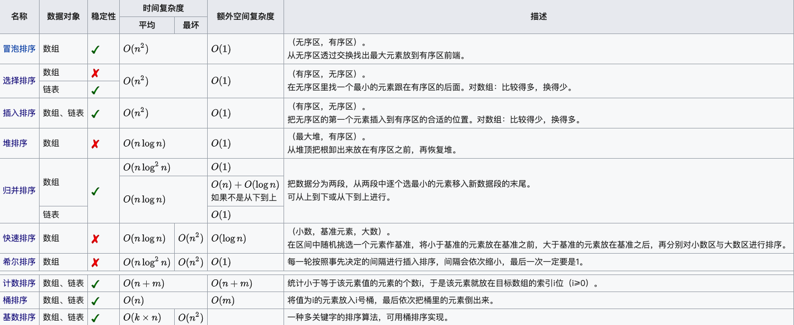
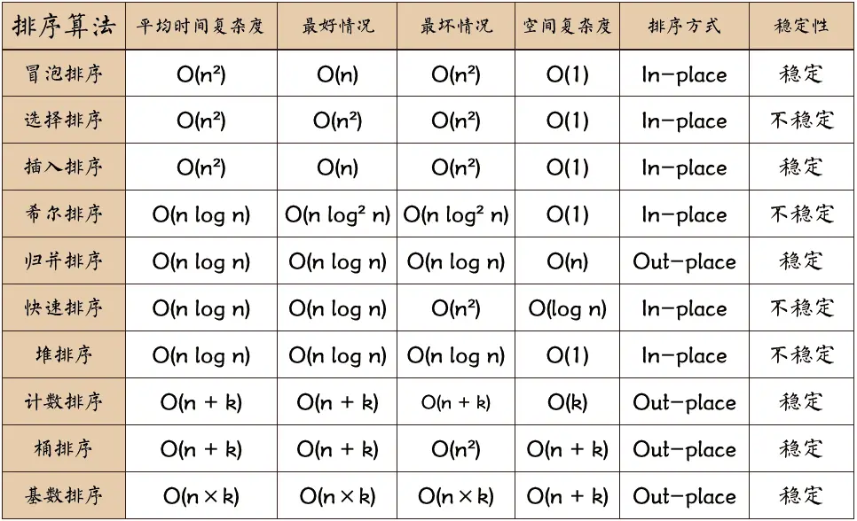
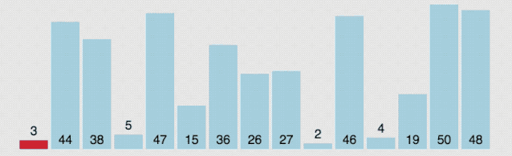
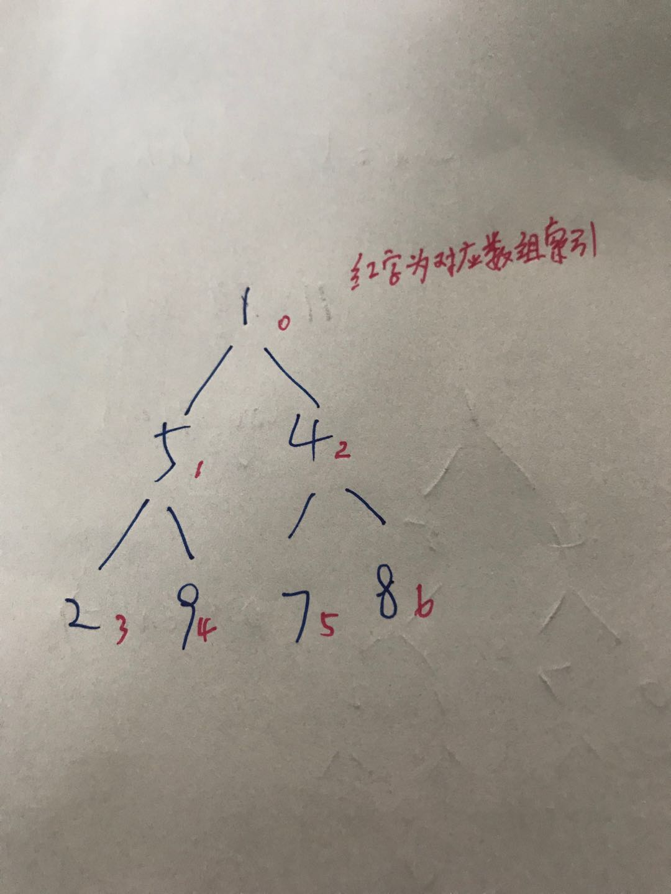
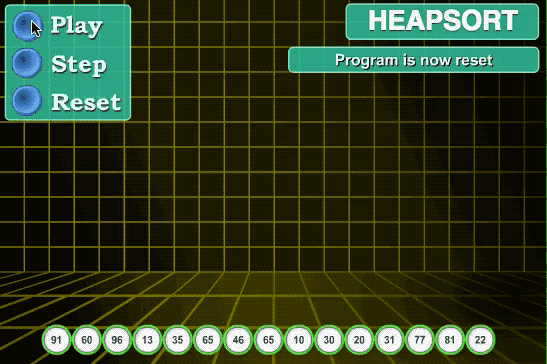
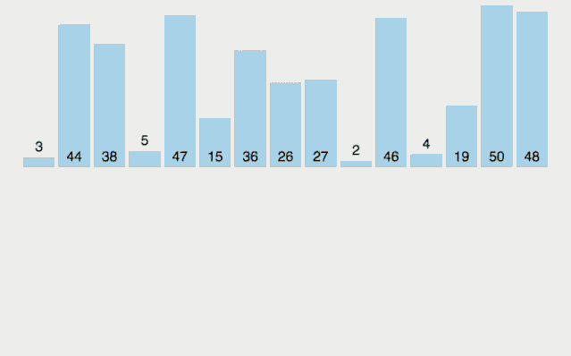
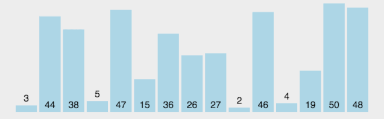
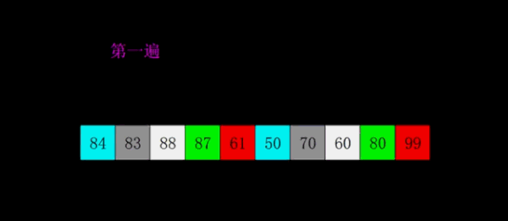
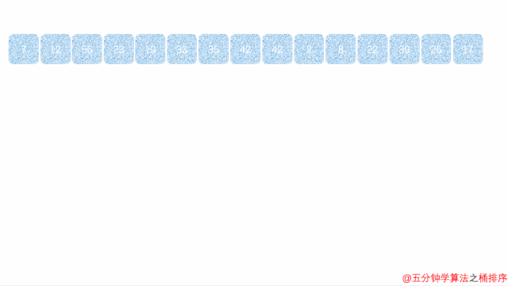

# 贰.1.1 十大排序算法

先看一张图表总结个中排序算法对比（点击可看大图）。



或看下面这张更经典的



## 01. 冒泡排序

冒泡排序是一种简单的排序算法，它重复地遍历要排序的数组，比较相邻的两个元素，如果它们的顺序错误就交换它们的位置。这个过程会一直重复，直到没有再需要交换的元素，也就是说该数组已经排序完成。

```javascript
((arr) => {
    const n = arr.length;
    for(let i = 0; i < n - 1; i++) {
        let swapped = false;
        // 每次循环将最大的元素"冒泡"到末尾
        for(let j = 0; j < n - 1 - i; j++) {
            if(arr[j] > arr[j + 1]) {
                // 交换相邻元素
                let tmp = arr[j];
                arr[j] = arr[j + 1];
                arr[j + 1] = tmp;
                swapped = true;
            }
        }
        // 如果没有发生交换，说明数组已经有序
        if (!swapped) break;
    }
    console.log(arr);
})([1, 5, 4, 2, 9, 7, 8]);//>>[1,2,4,5,7,8,9]
```

因为嵌套两个for循环，所以冒泡排序的时间复杂度为 $$O(N^2)$$，空间复杂度为 $$O(1)$$（只需要一个临时变量来交换元素）。

### 动画演示


## 02. 选择排序

假设数组A里面有N个项，选择排序是这样的：数组A第i个项记作 $$A_i$$，第\(i+1\)~\(N-1\)项中的最小\(最大的情况也是相似的逻辑）值记作 $$A_m$$ ，然后比较它俩大小，如果 $$A_m$$ 小于 $$A_i$$ ，交换位置……直到把整个数组处理一遍。代码如下：

```javascript
((arr) => {
    let N = arr.length;
    for(let i = 0; i < N - 1; i++) {
        let minIndex = i; // 从当前位置开始找最小值
        for(let j = i + 1; j < N; j++) {
            if(arr[j] < arr[minIndex]) {
                minIndex = j;
            }            
        }
        // 如果找到了更小的值，则交换
        if (minIndex !== i) {
            let tmp = arr[i];
            arr[i] = arr[minIndex];
            arr[minIndex] = tmp;
        }
    }
    console.log(arr);
})([1, 5, 4, 2, 9, 7, 8]);//>>[1,2,4,5,7,8,9]
```

可以看出选择排序也是一外一内两个for循环，因此时间复杂度也是 $$O(N^2)$$，空间复杂度为 $$O(1)$$。但是选择排序与冒泡排序差别地方在于：

* 选择排序的位置交换是在第二个for循环之外，第一个for循环之内，因此选择排序交换位置最多N次，而冒泡排序最多可能 $$N^2$$ 次。所以大多数情况下，选择排序比冒泡排序效率好一些。

### 动画演示



## 03. 插入排序

插入排序我们打扑克时给手中牌排序的思路一样，刚开始左手上一堆乱序的牌，我们把牌往手的右边挪一挪，把手的左边空出一点位置来，然后在右手乱牌中抽一张出来，插入到左边，再抽一张出来，插入到左边……每次插入都插入到左边合适的位置，时刻保持左边的牌是有序的，直到右边的牌抽完，则排序完毕。

代码实现如下：

```javascript
((arr) => {
    for(let i = 1; i < arr.length; i++) {
        let current = arr[i]; // 当前要插入的元素
        let j = i - 1; // 从已排序序列的右边开始比较
        
        // 将比current大的元素都向右移动一位
        while(j >= 0 && arr[j] > current) {
            arr[j + 1] = arr[j];
            j--;
        }
        
        // 找到current应该插入的位置
        arr[j + 1] = current;
    }
    console.log(arr);
})([1, 5, 4, 2, 9, 7, 8]);//>>[1,2,4,5,7,8,9]
```

从代码里我们可以看出，如果找到了合适的位置，就不会再进行比较了，就好比右手里抽出的一张牌本身就比我左手里的牌都小，那么我只需要直接放在左手靠边位置就行了，不用一张一张去移动牌腾出位置插入到中间。

所以说，最好情况的时间复杂度是 $$O(N)$$ ，最坏情况的时间复杂度是 $$O(N^2)$$ ，然而时间复杂度这个指标看的是最坏的情况，而不是最好的情况，所以插入排序的时间复杂度也是 $$O(N^2)$$。空间复杂度为 $$O(1)$$。

### 动画演示


## 04. 堆排序

堆的特性：

* 必须是完全二叉树；
* 任一结点的值是其子树所有结点的最大值或最小值。 最大值时，称为"**最大堆**"，也称大顶堆； 最小值时，称为"**最小堆**"，也称小顶堆。

堆排序主要用到最大堆/最小堆的删除操作，也即根节点已经是最大/小的值，排序的话，只需要把根结点拿（删）掉，放入有序的新数组里，然后用下沉算法处理剩余的结点以便组成新的最大堆/最小堆……如此循环。

所谓下沉算法，拿最小堆来举例说（最大堆同理），就是把完全二叉树根结点R和该树第二层左右子结点的值比较，如果大，结点就互换位置（"下沉"），以此逐层递归，直到处理完整棵树，此时，根节点值最小。

```javascript
((arr) => {
    var result = [];

    buildMinHeap(arr);

    for (let i = 0, length = arr.length; i < length; i++) {        
        //将堆（完全二叉树）的根结点拿走，放入result数组，此时result是已排序好的。
        result.push(arr[0]);

        //将堆（完全二叉树）的根结点和最末尾的结点交换
        swap(0, length-result.length);        
        //然后下沉，重排树，让根节点是最小的。注意【数组范围】是length-result.length
        sink(arr, 0, length - result.length);
    }

    //根据给定的数组建一个最小堆
    function buildMinHeap(arr) {
        let length = arr.length;
        let currentIndex;//当前要处理的下沉结点对应的数组索引
        //请注意，currentIndex为什么是从 Math.floor((length - 2) / 2) 开始？
        //读者可以画个草稿图归纳一下。
        //这会让算法的循环次数由N次变为logN，这正是堆排序更高效的关键所在。
        for (currentIndex = Math.floor((length - 2) / 2); currentIndex >= 0; currentIndex--) {
            console.log("正在处理的下沉结点索引为:"+currentIndex);
            sink(arr, currentIndex, length);
        }
    }

    /**
     * 下沉算法
     * @param arr 数组
     * @param currentIndex 要处理的结点的索引，该结点有子结点
     * @param length 数组范围
     */
    function sink(arr, currentIndex, length) {

        let minIndex=currentIndex;//较小值的索引，默认为currentIndex

        let leftChildIndex  = 2*currentIndex+1;//完全二叉树 左子结点索引
        let rightChildIndex = 2*currentIndex+2;//完全二叉树 右子结点索引

        //左侧下沉
        if(leftChildIndex < length && arr[leftChildIndex] < arr[minIndex])
            minIndex = leftChildIndex;

        //右侧下沉
        if (rightChildIndex < length && arr[rightChildIndex] < arr[minIndex])
            minIndex = rightChildIndex;

        if(minIndex!=currentIndex){
            swap(minIndex,currentIndex);
            //递归，继续下沉，时间复杂度为O(N)
            sink(arr,minIndex,length);
        }
    }

    //交换位置
    function swap(x, y) {
        let tmp = arr[x];
        arr[x] = arr[y];
        arr[y] = tmp;
    }

    console.log(result);

})([1, 5, 4, 2, 9, 7, 8]);//>> [1, 2, 4, 5, 7, 8, 9]
```

草稿图可以这么画，然后归纳、设计代码，更方便理解。



堆排序的时间复杂度是 $$O(NlogN)$$，空间复杂度为 $$O(1)$$（原地排序）。

### 动画演示



## 05. 归并排序

归并排序是建立在归并操作上的一种有效的排序算法，该算法是采用分治法（Divide and Conquer）的一个非常典型的应用。将已有序的子序列合并，得到完全有序的序列；即先使每个子序列有序，再使子序列段间有序。若将两个有序表合并成一个有序表，称为二路归并。

归并排序的核心思想是：
1. 将数组分成两半
2. 递归地对两半进行归并排序
3. 将两个有序数组合并成一个有序数组

```javascript
((arr) => {
    function mergeSort(arr) {
        if (arr.length <= 1) {
            return arr;
        }
        
        // 将数组分成两半
        const mid = Math.floor(arr.length / 2);
        const left = arr.slice(0, mid);
        const right = arr.slice(mid);
        
        // 递归排序两半
        const sortedLeft = mergeSort(left);
        const sortedRight = mergeSort(right);
        
        // 合并两个有序数组
        return merge(sortedLeft, sortedRight);
    }
    
    function merge(left, right) {
        const result = [];
        let i = 0, j = 0;
        
        // 比较两个数组的元素，将较小的放入结果数组
        while (i < left.length && j < right.length) {
            if (left[i] <= right[j]) {
                result.push(left[i]);
                i++;
            } else {
                result.push(right[j]);
                j++;
            }
        }
        
        // 将剩余元素添加到结果数组
        while (i < left.length) {
            result.push(left[i]);
            i++;
        }
        
        while (j < right.length) {
            result.push(right[j]);
            j++;
        }
        
        return result;
    }
    
    const sortedArr = mergeSort(arr);
    console.log(sortedArr);
})([1, 5, 4, 2, 9, 7, 8]);//>> [1, 2, 4, 5, 7, 8, 9]
```

归并排序的时间复杂度是 $$O(NlogN)$$，空间复杂度是 $$O(N)$$。它的优点是稳定排序，时间复杂度稳定，缺点是需要额外的空间。

### 动画演示



## 06. 快速排序

快速排序其实是[分治法](2.1.6.md#fen-zhi-fa)，将待排序数组里的项和基准数对比，比基准数大的放在一边，小的放另一边，然后再对左右两边的子数组重复使用这个思路，直到整个数组排序完毕。

```javascript
((arr) => {
   /**
   * @param    left    数组的最左侧项的索引
   * @param    right    数组的最右侧项的索引
   */
   function quicksort(left, right) {
      let i/*左指针索引*/, j/*右指针索引*/, temp/*基准数*/;
      if (left > right)
         return;
      temp = arr[left];//取数组第一个项为基准数
      i = left;
      j = right;
      while (i != j) { //若左右两个指针没碰头        
         while (arr[j] >= temp && i < j)//顺序很重要，要先从右边开始找，直到找到比temp小的为止
            j--;
         while (arr[i] <= temp && i < j)//再找左边的，直到找到比temp大的数为止
            i++;
         if (i < j)//交换这两个数在数组中的位置，让小的在左边，大的在右边
         {
            let t = arr[i];
            arr[i] = arr[j];
            arr[j] = t;
         }
      }
      //然后将基准数与小的数换位，将小的数放在最左边，基准数放中间
      arr[left] = arr[i];
      arr[i] = temp;
      
      quicksort(left, i - 1);//递归。继续处理左边的，这里是一个递归的过程
      quicksort(i + 1, right);//递归。继续处理右边的 ，这里是一个递归的过程
   }

   quicksort(0, arr.length - 1);
   console.log(arr);
})([1, 5, 4, 2, 9, 7, 8]);//>> [1, 2, 4, 5, 7, 8, 9]
```

时间复杂度最好的情况是 $$O(NlogN)$$，最差的情况是 $$O(N^2)$$。算法分析：

* 当分区选取的基准元素为待排序元素中的最大或最小值时，为最差的情况，时间复杂度和直接插入排序的一样，移动次数达到最大值

  `Cmax = 1+2+...+(n-1) = n*(n-1)/2 = O(n2)`   
  此时时间复杂为 $$O(N^2)$$ ；

* 当分区选取的基准元素为待排序元素中的"中值"，为最好的情况，时间复杂度为 $$O(NlogN)$$。

快速排序的空间复杂度为 $$O(logN)$$（递归调用栈的深度），最坏情况下为 $$O(N)$$。

### 动画演示



## 07. 希尔排序

希尔排序是插入排序的一种改进版本，也称为缩小增量排序。它通过比较相距一定间隔的元素来工作，各趟比较所用的距离随着算法的进行而减小，直到最后一趟比较相邻元素。

希尔排序的核心思想是：
1. 设定一个初始间隔gap
2. 按照gap分组，对每组使用插入排序
3. 减小gap，重复步骤2
4. 当gap=1时，就是普通的插入排序

```javascript
((arr) => {
    function shellSort(arr) {
        const n = arr.length;
        
        // 初始间隔设为数组长度的一半
        for (let gap = Math.floor(n / 2); gap > 0; gap = Math.floor(gap / 2)) {
            // 对每个子序列进行插入排序
            for (let i = gap; i < n; i++) {
                let temp = arr[i];
                let j;
                
                // 在子序列中寻找插入位置
                for (j = i; j >= gap && arr[j - gap] > temp; j -= gap) {
                    arr[j] = arr[j - gap];
                }
                
                arr[j] = temp;
            }
        }
        
        return arr;
    }
    
    const sortedArr = shellSort(arr);
    console.log(sortedArr);
})([1, 5, 4, 2, 9, 7, 8]);//>> [1, 2, 4, 5, 7, 8, 9]
```

希尔排序的时间复杂度取决于间隔序列的选择，最坏情况下是 $$O(N^2)$$，但在实际应用中通常比 $$O(N^2)$$ 要好。空间复杂度为 $$O(1)$$。它的优点是对于中等大小的数组表现良好，且代码相对简单。

### 动画演示



## 08. 计数排序

计数排序是一种非比较排序算法，它通过统计每个元素出现的次数来进行排序。计数排序适用于已知数据范围的整数排序，特别是当数据范围不大时效率很高。

计数排序的核心思想是：
1. 统计每个元素出现的次数
2. 根据统计结果重构原数组

```javascript
((arr) => {
    function countingSort(arr) {
        const n = arr.length;
        
        // 找到数组中的最大值和最小值
        let max = arr[0];
        let min = arr[0];
        for (let i = 1; i < n; i++) {
            if (arr[i] > max) max = arr[i];
            if (arr[i] < min) min = arr[i];
        }
        
        const range = max - min + 1;
        const count = new Array(range).fill(0);
        const output = new Array(n);
        
        // 统计每个元素出现的次数
        for (let i = 0; i < n; i++) {
            count[arr[i] - min]++;
        }
        
        // 计算每个元素应该放置的位置
        for (let i = 1; i < range; i++) {
            count[i] += count[i - 1];
        }
        
        // 从后往前遍历，保证稳定性
        for (let i = n - 1; i >= 0; i--) {
            output[count[arr[i] - min] - 1] = arr[i];
            count[arr[i] - min]--;
        }
        
        // 将结果复制回原数组
        for (let i = 0; i < n; i++) {
            arr[i] = output[i];
        }
        
        return arr;
    }
    
    const sortedArr = countingSort(arr);
    console.log(sortedArr);
})([1, 5, 4, 2, 9, 7, 8]);//>> [1, 2, 4, 5, 7, 8, 9]
```

计数排序的时间复杂度是 $$O(N + K)$$，其中K是数据范围。空间复杂度为 $$O(N + K)$$。当数据范围不大时，计数排序的效率很高，但需要额外的空间来存储计数数组。

### 动画演示


## 09. 桶排序

桶排序是计数排序的升级版，它利用了函数的映射关系，高效与否的关键就在于这个映射函数的确定。桶排序的工作的原理：假设输入数据服从均匀分布，将数据分到有限数量的桶中，每个桶再分别排序（有可能再使用别的排序算法或是以递归方式继续使用桶排序进行排）。

桶排序的核心思想是：
1. 将数据分到有限数量的桶中
2. 对每个桶中的数据进行排序
3. 将桶中的数据按顺序合并

```javascript
((arr) => {
    function bucketSort(arr, bucketSize = 5) {
        if (arr.length === 0) return arr;
        
        // 找到数组中的最大值和最小值
        let min = arr[0];
        let max = arr[0];
        for (let i = 1; i < arr.length; i++) {
            if (arr[i] < min) min = arr[i];
            if (arr[i] > max) max = arr[i];
        }
        
        // 创建桶
        const bucketCount = Math.floor((max - min) / bucketSize) + 1;
        const buckets = new Array(bucketCount);
        for (let i = 0; i < bucketCount; i++) {
            buckets[i] = [];
        }
        
        // 将数据分配到桶中
        for (let i = 0; i < arr.length; i++) {
            const bucketIndex = Math.floor((arr[i] - min) / bucketSize);
            buckets[bucketIndex].push(arr[i]);
        }
        
        // 对每个桶中的数据进行排序
        for (let i = 0; i < buckets.length; i++) {
            buckets[i].sort((a, b) => a - b);
        }
        
        // 将桶中的数据按顺序合并
        let index = 0;
        for (let i = 0; i < buckets.length; i++) {
            for (let j = 0; j < buckets[i].length; j++) {
                arr[index++] = buckets[i][j];
            }
        }
        
        return arr;
    }
    
    const sortedArr = bucketSort(arr);
    console.log(sortedArr);
})([1, 5, 4, 2, 9, 7, 8]);//>> [1, 2, 4, 5, 7, 8, 9]
```

桶排序的时间复杂度是 $$O(N + K)$$，其中K是桶的数量。空间复杂度为 $$O(N + K)$$。当数据分布均匀时，桶排序的效率很高，但需要额外的空间来存储桶。

### 动画演示



## 10. 基数排序

基数排序是一种非比较排序算法，它通过将整数按位数切割成不同的数字，然后按每个位数分别比较来进行排序。基数排序适用于整数排序，特别是当数据范围很大但位数相对较少时。

基数排序的核心思想是：
1. 从最低位开始，按每一位进行排序
2. 使用稳定的排序算法（如计数排序）对每一位进行排序
3. 重复步骤1-2，直到最高位

```javascript
((arr) => {
    function radixSort(arr) {
        // 找到数组中的最大值
        let max = arr[0];
        for (let i = 1; i < arr.length; i++) {
            if (arr[i] > max) max = arr[i];
        }
        
        // 计算最大值的位数
        let maxDigit = 1;
        while (Math.floor(max / 10) > 0) {
            maxDigit++;
            max = Math.floor(max / 10);
        }
        
        // 对每一位进行排序
        for (let digit = 0; digit < maxDigit; digit++) {
            // 创建10个桶（0-9）
            const buckets = Array.from({length: 10}, () => []);
            
            // 将数据分配到桶中
            for (let i = 0; i < arr.length; i++) {
                const bucketIndex = Math.floor(arr[i] / Math.pow(10, digit)) % 10;
                buckets[bucketIndex].push(arr[i]);
            }
            
            // 将桶中的数据按顺序合并
            let index = 0;
            for (let i = 0; i < 10; i++) {
                for (let j = 0; j < buckets[i].length; j++) {
                    arr[index++] = buckets[i][j];
                }
            }
        }
        
        return arr;
    }
    
    const sortedArr = radixSort(arr);
    console.log(sortedArr);
})([1, 5, 4, 2, 9, 7, 8]);//>> [1, 2, 4, 5, 7, 8, 9]
```

基数排序的时间复杂度是 $$O(D(N + K))$$，其中D是最大数的位数，K是基数（通常是10）。空间复杂度为 $$O(N + K)$$。基数排序适用于整数排序，特别是当数据范围很大但位数相对较少时效率很高。

### 动画演示


## 总结

以上十种排序算法各有特点：

### 按时间复杂度分类：
- **冒泡排序、选择排序、插入排序**：时间复杂度 $$O(N^2)$$，适合小数据量
- **希尔排序**：改进的插入排序，时间复杂度介于 $$O(N)$$ 和 $$O(N^2)$$ 之间
- **堆排序、归并排序、快速排序**：时间复杂度 $$O(NlogN)$$，适合大数据量
- **计数排序、桶排序、基数排序**：时间复杂度 $$O(N + K)$$，适合特定数据分布

### 按空间复杂度分类：
- **原地排序**（$$O(1)$$）：冒泡排序、选择排序、插入排序、堆排序、希尔排序
- **需要额外空间**（$$O(N)$$ 或更高）：归并排序、快速排序、计数排序、桶排序、基数排序

### 按稳定性分类：
- **稳定排序**：冒泡排序、插入排序、归并排序、计数排序、桶排序、基数排序
- **不稳定排序**：选择排序、堆排序、快速排序、希尔排序

在实际应用中，需要根据数据规模、数据特征、稳定性要求、内存限制等因素来选择合适的排序算法。


