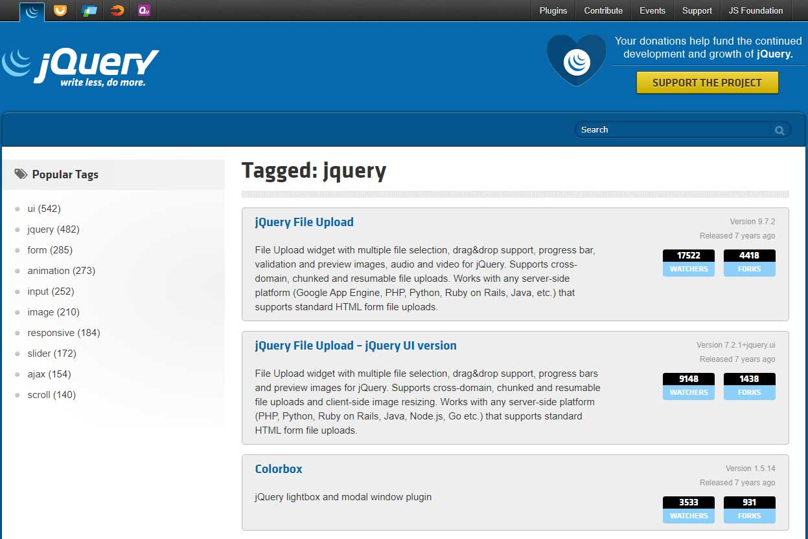

# 叁.1.1 jQuery过时了吗？

## 叁.1.1.1 jQuery带来的好处

Jhon Resig在2006年发布了jQuery第一版，十几年过去了，截止2019年6月的统计，jQuery仍然被全球最活跃的前1000万个网站中的73%所使用，其影响力之大可见一斑。jQuery作为最流行的JavaScript库，其诞生之初便为前端开发带来了以下好处：

### **1. 解决了当时浏览器兼容问题**

jQuery诞生时的2006年，微软IE6在浏览器市场里所占份额最大。这个“傲慢”的浏览器自成一套，很多API没有遵从W3C标准，因此造成各种兼容问题（出于浏览器大战时的竞争策略的考虑，微软没有把遵从W3C标准放在重要的位置）。调用某些相同功能的DOM API，IE6与其他浏览器比如Firefox、Opera、Safari在语法上有差异。这让前端工程师经常要写两份甚至多份代码，不胜其苦。最烦恼的还不止于此，微软自己的浏览器，若版本不一样居然也有兼容性问题，比如IE6的代码居然也不兼容IE7、IE8！此时jQuery出现了，它及时、有效地解决了这些问题，让前端工程师只需要写一份代码，无须担心兼容性。这也是jQuery大受欢迎的最重要的原因。

### **2. 发明了一种便捷的DOM操作方式**

### **3. 实现了平滑的动画效果**

### **4. 封装了极易使用的Ajax**

## 叁.1.1.2 更好的替代方案

随着时代的发展，毕竟也有十几年过去了，前端开发有了很大的变化。针对jQuery的4点特性，现在已经有更好的替代方案。

### 1. 针对兼容性

现在浏览器的兼容性逐渐提升。兼容性做得极差的浏览器IE6已经成为历史，甚至在绝大多数生产环境，连IE8也可以不考虑。实在不行，还有Babel.js这样的轻量级的库存在。

### 2. 针对DOM操作

针对于选择器，已经有成为W3C标准的`document.querySelector`来替代。而MVVM一类的框架比如React/Vue/Angular的流行，其双向绑定的特性已经让DOM的更新变成由框架自行处理，让前端工程师可以不需要操作DOM（改为让框架自行去操作Vitual DOM），只需要专注数据和业务逻辑。

### 3. 动画领域的替代方案

动画已经有了css3，不再需要古老的计时器来做动画。

### 4. Ajax也有了更好的替代

Fetch已经完美地取代Ajax成为实现异步任务的标准。

## 叁.1.1.3 jQuery留给我们的财富

### 1. 大量功能强大、方便使用的插件

jQuery发展这么多年，它最大的价值之一在于社区积攒的各种插件。无论是做日期选择器还是轮播图，甚至搞个播放器，都可以分分钟找到一个对应的插件。 比如 [CSS transitions and transformations for jQuery](http://ricostacruz.com/jquery.transit/) 这个动画插件，我到现在也还在用，完全没问题。

更多宝矿可以自行浏览jQuery插件网站：[https://plugins.jquery.com/](https://plugins.jquery.com/) 这个网站虽然不再接纳新的插件，但可以作为一份地图，可以方便找到jQuery流行插件的Github主页，然后你会发现，很多插件都还非常活跃而且更新非常频繁。

### 2.巧夺天工的库/框架设计思路

### 3.一些鬼斧神工似的编程技巧

## 结语

## 参考文献


[https://en.wikipedia.org/wiki/JQuery](https://en.wikipedia.org/wiki/JQuery)  
[https://zh.wikipedia.org/wiki/%E6%B5%8F%E8%A7%88%E5%99%A8%E5%A4%A7%E6%88%98](https://zh.wikipedia.org/wiki/%E6%B5%8F%E8%A7%88%E5%99%A8%E5%A4%A7%E6%88%98)


