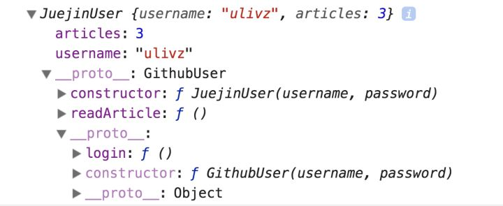

# 陆.2.3 重新认识JavaScript面向对象: 继承

抛开JavaScript自带的Class语法糖实现的累的继承，如果用原生JavaScript实现类的继承，有以下六种方式，其实现代码与优缺点分析如下：

## 01.类式继承

```javascript
function GithubUser(username) {
    this.username = 'Unknown' 
}

function JuejinUser(username, password) {}

JuejinUser.prototype =  new GithubUser() 
const juejinUser1 = new JuejinUser('ulivz', 'xxx', 3)
const juejinUser2 = new JuejinUser('egoist', 'xxx', 0)

//  这就是把属性定义在原型链上的致命缺点，你可以直接访问，但修改就是一件难事了！
console.log(juejinUser1.username) // 'Unknown'
juejinUser1.__proto__.username = 'U' 
console.log(juejinUser1.username) // 'U'

// WOW，无情地影响了另一个实例!!!
console.log(juejinUser2.username) // 'U'
```

缺陷太多。

## 02.构造函数式继承

通过call/apply调用来实现继承：

```javascript
function GithubUser(username, password) {
    let _password = password 
    this.username = username 
    GithubUser.prototype.login = function () {
        console.log(this.username + '要登录Github，密码是' + _password)
    }
}

function JuejinUser(username, password) {
    GithubUser.call(this, username, password);
    this.articles = 3 // 文章数量
}

const juejinUser1 = new JuejinUser('ulivz', 'xxx')
console.log(juejinUser1.username) // ulivz
console.log(juejinUser1.username) // xxx
console.log(juejinUser1.login()) // TypeError: juejinUser1.login is not a function
```

存在明显的缺陷：并没有继承父类原型上的方法。

## 03.组合式继承

既然上述两种方法各有缺点，但是又各有所长，那么我们是否可以将其结合起来使用呢？没错，这种继承方式就叫做——组合式继承:

```javascript
function GithubUser(username, password) {
    let _password = password 
    this.username = username 
    GithubUser.prototype.login = function () {
        console.log(this.username + '要登录Github，密码是' + _password)
    }
}

function JuejinUser(username, password) {
    GithubUser.call(this, username, password) // 第2次执行 GithubUser 的构造函数
    this.articles = 3 // 文章数量
}

JuejinUser.prototype = new GithubUser(); // 第1次执行 GithubUser 的构造函数
const juejinUser1 = new JuejinUser('ulivz', 'xxx')
```

虽然这种方式弥补了上述两种方式的一些缺陷，但有些问题仍然存在：

* 子类仍旧无法传递动态参数给父类；
* 父类的构造函数被调用了两次。

本方法很明显执行了两次父类的构造函数，因此，这也不是我们最终想要的继承方式。

## 04.原型继承

原型继承实际上是对类式继承的一种封装，只不过其独特之处在于，定义了一个干净的中间类，如下：

```javascript
function createObject(o) {
    // 创建临时类
    function F() {
        
    }
    // 修改类的原型为o, 于是f的实例都将继承o上的方法
    F.prototype = o;
    return new F();
}
```

这不就是ES5的 `Object.create` 吗？没错，你可以认为是如此。

既然只是类式继承的一种封装，其使用方式自然如下：

```text
JuejinUser.prototype = createObject(GithubUser)
```

也就仍然没有解决类式继承的一些问题。从这个角度而言，原型继承和类式继承应该直接归为一种继承。

## 05.寄生式继承

寄生式继承是与原型继承紧密相关的一种思路，它依托于一个内部对象而生成一个新对象，因此称之为寄生。

```javascript
const UserSample = {
   username: 'ulivz',
   password: 'xxx'
}

function Coffe1891User(obj) {
   var o = Object.create(obj);//o继承obj的原型
   o.__proto__.readArticle = function () {//扩展方法
      console.log('Read article');
   }
   return o;
}

var user = new Coffe1891User(UserSample);
console.log(user);

```

## 06.寄生组合式继承

```javascript
// 寄生组合式继承的核心方法
function inherit(child, parent) {
    // 继承父类的原型
    const p = Object.create(parent.prototype)
    // 重写子类的原型
    child.prototype = p
    // 重写被污染的子类的constructor
    p.constructor = child
}

// GithubUser, 父类
function GithubUser(username, password) {
    let _password = password 
    this.username = username 
}

GithubUser.prototype.login = function () {
    console.log(this.username + '要登录Github，密码是' + _password)
}

// GithubUser, 子类
function JuejinUser(username, password) {
    GithubUser.call(this, username, password) // 继承属性
    this.articles = 3 // 文章数量
}

// 实现原型上的方法
inherit(JuejinUser, GithubUser)

// 在原型上添加新方法
JuejinUser.prototype.readArticle = function () {
    console.log('Read article')
}

const juejinUser1 = new JuejinUser('ulivz', 'xxx')
console.log(juejinUser1)
```

观察chrome浏览器的输出结果：



简单说明一下：

* 子类继承了父类的属性和方法，同时，属性没有被创建在原型链上，因此多个子类不会共享同一个属性。
* 子类可以传递动态参数给父类！
* 父类的构造函数只执行了一次！

Nice！这才是我们想要的继承方法。然而，仍然存在一个美中不足的问题：

* 子类想要在原型上添加方法，必须在继承之后添加，否则将覆盖掉原有原型上的方法。这样的话 若是已经存在的两个类，就不好办了。

所以，我们可以将其优化一下：

```javascript
function inherit(child, parent) {
    // 继承父类的原型
    const parentPrototype = Object.create(parent.prototype)
    // 将父类原型和子类原型合并，并赋值给子类的原型
    child.prototype = Object.assign(parentPrototype, child.prototype)
    // 重写被污染的子类的constructor
    p.constructor = child
}
```

但实际上，使用`Object.assign` 来进行 copy 仍然不是最好的方法。因为根据本书[ 深拷贝与浅拷贝](../1/1.3.1.md#2object-de-nei-zhi-fang-fa-assign)的描述，上述的继承方法只适用于 copy 原型链上可枚举的方法，而ES6中，类的方法默认都是不可枚举的。此外，如果子类本身已经继承自某个类，以上的继承将不能满足要求。

## 参考文献


[深入JavaScript继承原理](https://zhuanlan.zhihu.com/p/34481895)


