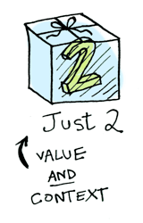
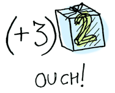

# 陆.3.1 什么是函数式编程？

## 函数式编程与命令式编程

函数式编程是相对命令式编程而言的，二者都属于编程范式，最大的不同在于：

**函数式编程关心数据的映射，命令式编程关心解决问题的步骤。**

所谓命令式编程，也就是说你要做什么事情，得把达到目的的步骤详细描述出来，然后交给机器去运行。这也正是命令式编程的理论模型“图灵机”的特点，一条写满数据的纸带，一条根据纸带内容运动的机器，机器每动一步都需要纸带上写着如何达到。

来看一个例子：统计小组5个同学体重之。即使是刚入门的前端工程师也可以很快写出如下代码：

```javascript
let sudentsWeight=[49,50,43,55,64];//存放每个学生的体重

let sum=0;
for(let i=0;i<sudentsWeight.length;i++){
    sum+=sudentsWeight[i];
}
console.log(sum);//>> 261
```

通过一个for循环，然后引入一个临时变量sum与每个学生体重相加，最后打印结果。这就是典型的命令式编程，你要做什么事情，得把达到目的的步骤详细的描述出来，然后交给机器去运行。在这个过程中，引入了一个临时变量sum，并且for循环一次，sum的值便被改变一次，并且进行一个打印结果的操作，这些都是**副作用**。

那么，不用这种方式，函数式编程会如何做呢？如下：

```javascript
let sudentsWeight=[49,50,43,55,64];//存放每个学生的体重
sudentsWeight.reduce((a,b)=>a+b);//>> 261
```

上面的代码，函数式编程主要表达要实现什么（调用`reduce`函数求和），而不是在描述具体的实现的步骤。具体的步骤已经封装到`reduce`函数里面，我们看不到也暂时不用关心。这样就可以把程序员从程序的步骤控制中解放出来，专注于要实现什么。是不是很简洁，而且中间没有副作用。

> 关于“副作用”的更多阐释，引用自《Java函数式编程》：
>
> 当我说“没有副作用”的时候，我是指没有可观测到的副作用。函数式的程序是由接收参数并返回值的函数复合而成的，仅此而已。你并不关心函数内部发生了什么……但是在实际上，程序是为完全非函数式的计算机而编写的。所有的计算机都基于相同的命令式范式，所以函数就是如下黑盒：  
> ■ 接收一个参数（一个单独的参数）。   
> ■ 内部做一些神秘的事情，例如改变变量的值，还有许多命令式风格的东西，但是在外界来看并没有什么东西。  
> ■ 返回一个（单独的）值。   
> 这只是理论。实际上，函数不可能完全没有副作用。函数会在某个时候返回一个值，而这个值可能是变化的。这就是一个副作用。它可能会造成一个内存耗尽的错误，或者是堆栈溢出的错误，导致应用程序崩溃，这在某种意义上就是一个可观测到的副作用。并且它还会造成写内存、寄存器变化、加载线程、上下文切换和其他确实会影响外界观测的这类事情。   
> 所以函数式编程其实是编写非故意的副作用的程序，我的意思是，副作用是程序预期结果的一部分。非故意的副作用也应该越少越好。

那么，数据的映射又是什么意思呢？还是上面的例子，如果要求给每个学生体重单位由公斤变成克，函数式编程该怎么弄呢？如下代码：

```javascript
let sudentsWeight=[49,50,43,55,64];//存放每个学生的体重
sudentsWeight.map((a)=>a*1000);//>> [49000, 50000, 43000, 55000, 64000]
```

这段代码体现的思维，就是**旧体重数组到新体重数组的映射。**

如果看到这里还是云里雾里的话，别着急，可能因为我们对函数式编程的一些基础概念没有了解，接着往下看。

## 纯函数与非纯函数

 所谓的纯函数就是，**对于相同的输入，永远会得到相同的输出，而且没有任何可观察的副作用，也不依赖外部环境的状态。**比如下面代码：

```javascript
let arr=[1,2,3,4,5];
arr.slice(0,2);//这是纯函数，因为只要参数一样，输出总一样
arr.slice(0,2);//输出结果与上一句相同

arr.splice(0,2);//非纯函数，参数一样，但是输出变化了
arr.splice(0,2);//输出变化了，与上一句结果不同
```

另外`Date.now()`也是不纯的，他总是依赖时间来返回不同的结果。

纯函数是函数式编程至关重要的前提，也即函数的输出只能取决于函数的参数输入。

我们写代码的时候，可能会因为代码严重依赖环境，有时候调用同一个函数，输入相同的参数，导致结果居然不同，更不用说由此带来的各种副作用了。

而采用函数式编程，确定的输入决定了确定的输出，这意味着只要参数对了，结果一定在预期中。也就是说，**函数式编程没有无法重现的bug**！在这样的前提下，单元测试相对容易实现，能极大地增强程序员的代码自信。

## 函子（Functor）

### 定义

在函数式编程中，Functor（函子）可以说是一个很基础的概念。

当然了，还有一个更基础的概念是函数\(function\)。在函数式编程的世界里，函数它实际上表达的是一个对象到另一个对象的映射关系（我在这里使用了对象一词，因为作为一个Java程序员，对象可以说是最熟悉的概念）。上面提到的第一个对象，指的是函数的输入参数；而另外一个对象，则是指函数返回的结果；映射关系指的是函数。

**函数处理的是对象，而函子则处理的是范畴。**所谓“范畴”，从编程的角度来理解，我们可以理解成高阶对象。那么，**函子表达的是范畴到范畴的映射关系**。

什么是“高阶对象”呢？ 实际上就是更为复杂的对象，或者类型（指typeclass，非面向对象编程里面的class），也可以通俗理解为“容器”。 比如： 一个int类型的对象是一个简单对象，那么一个int数组则是一个更为高阶的对象。 

而下面Java代码中的IM属于简单对象，Employee属于高阶对象。


其实要系统学习函数式编程，学一下Haskell语言比较好。但是Haskell笔者也没学过，时间有限，要学的东西又似乎无限，怎么办？好在笔者学过Java，而因为JavaScript不是强类型语言，Java 8的Stream API增加了对函数式编程的支持，为方便举例说明，本文会临时借用Java 8来举例说明。


```java
/*Java*/

class Communication
{
    private int type;
}

//简单对象
class IM extends Communication
{
    private String code;
}

//高阶对象
class Employee
{
    private int emplNo;
    private String firstName;
    private String lastName;
    private Communication communication;
}
```

再来看看这个简单的add函数：

```javascript
/*Java*/

public int add(int someNumber)
{
    return someNumber + 3;
}
```

函数add是对简单的int对象做映射；那么对应的函子应是对int数组做映射，具体说来就是对int数组的每一个元素做加3的映射。所以，**函子可以把一个作用于简单对象的函数，应用到一个高阶对象。**如果把上面的add函数变换成对数组每一个元素加3，如下代码，Java8的`Stream`对象就是一个函子。

```javascript
/*Java*/

List<Integer> list = Arrays.asList(1, 2, 3, 4, 5);
list.stream().map(i -> i + 3).forEach(System.out::println);
```

上面的代码多了个`map`方法是做什么的？没错， **函子必须实现 map这个特定的方法（或称为函数）**，名称可能不一定是map，但是功能是一样的。

为方便理解，下面再以图例来说明如何从函数到函子的：

\(1\) 简单对象一般为值类型：


\(2\) 简单对象和函数之间的关系如下图：


\(3\) 高阶对象是一个容器\(下图中的context\)，包含其他对象：



\(4\) 对于高阶对象，不能直接应用函数，需要先打开这个容器：



\(5\) 因此，定义一个新的方法 `map`来解决在高阶对象上使用函数的问题：


**这个实现了map方法的类型类（typeclass），我们就称之为函子。**


函数式编程中的类型类（typeclass）是定义行为的接口。 如果一个类型是某个类型类的实例，那么这个类型必须实现所有该类型类所定义的行为。不要因为有“类”这个字就把类型类与面向对象中的类混淆， 他们是完全不同的概念。类型构造器能够接收其他类型为参数，创建出新的类型。举个例子，Java的List即为接收一个类型参数的类型构造器， 当类型参数为Int时，List类型构造器的返回类型为List&lt;Int&gt;，当类型参数为String时，返回类型为List&lt;String&gt;。 与类型构造器相对的概念是值构造器，比如Integer\(2\)。


所谓的map方法，就是将高阶对象这个容器打开，取出里面的简单对象，然后再对简单对象应用map方法传递过来的函数，再把应用函数后的结果又包装成高阶对象，最后将这个高阶对象返回。

### 函子的作用

这么绕一圈儿弄出个函子的概念有什么用呢？

函子并不刻意造出来的，是先有了用法然后总结归纳出来的基础概念。

有了函子，让只能处理简单对象的函数可以处理高阶对象，而且想要什么结果，传入对应的函数给函子就行，传入不同的函数，产生不同的结果，比较灵活。换句话来说，我们让函子自己来运行这个函数，这样函子就可以自由地选择何时何地如何操作这个函数，以致于拥有惰性求值、错误处理、异步调用等等非常出色的特性。而且代码也十分简洁，在后续文章，会发现函数式编程的代码一向表现得更简洁一些。

读者可能会说，“喔，原来JavaScript里面的Array，自带了map方法，已经实现了函子的概念，而Array也就是函子”，的确，没错！

## 加强版函子（Applicative）

如果理解了函子，就很容易理解加强版函子了。

函子是将简单对象放到了容器\(context\)里，处理这种简单对象的函数通过map方法传进来；加强版函子更进一步，把函数也放进了容器。


没错，这么做了之后，意味着函数和函数处理的数据（简单对象或高阶对象）都被高度抽象化了。高度抽象化的结果就是高度的灵活性、可扩展性、可维护性。

## 单子（Monad）

//todo

## 柯里化与函数式编程

关于柯里化的基础知识，请回顾“[JavaScript函数柯里化](../1/1.3.2.md)”。

那么柯里化和函数式编程又有什么联系呢？

//todo

## 函数式编程的好处

其实前面已经穿插的讲了很多函数式编程的好处，本篇最后总结归纳一下。

首先，最直观的角度来说，函数式风格的代码可以写得更简洁，大大减少了程序员的键盘敲击输入量。

其次，函数式的代码是“对映射的描述”，它不仅可以描述二叉树这样的数据结构之间的对应关系，任何能在计算机中体现的东西之间的对应关系都可以描述——比如函数和函数之间的映射（比如Functor）；比如外部操作到 GUI 之间的映射（就是现在前端热炒的 FRP——响应式编程的一种范式）。它的抽象程度可以很高，这就意味着函数式的代码可以更方便的复用。

再次，函数式编程将细节封装到函数内部隐藏起来，不过多的依赖外部环境，让程序员专注业务的实现，优化的时候，可以专注优化函数内部实现即可，甚至无需改动代码，可以让代码更容易维护。

另外，可以方便的并行计算。

最后，将代码写成这种样子可以方便用数学思维进行科学研究。


参考文献：  
[Functors, Applicatives, And Monads In Pictures](http://adit.io/posts/2013-04-17-functors,_applicatives,_and_monads_in_pictures.html)  
[《Java函数式编程》](https://book.douban.com/subject/27594722/)



